# Precomputed annotation indices

This repo wraps a Code Ocean pipeline repo that produces various indices of precomputed annotations, crucially spatial indices to expedite rapid user interface interactions in Neuroglancer.

At the time of this writing, three indices are produced for a given input of annotation data:

1. ID index
2. Relation index
3. Spatial index

The resulting indices are uploaded to a Google bucket with an accompanying ***info*** file with Neuroglancer's expected folder/file structure to facilitate retrieval of the index (or parts thereof on the fly). The bucket will also contain a ***pipeline_config.json*** file that, amongst other data, provides the GCP bucket URI that Neuroglancer requires. Simply copy that URI from the json file and paste it into the Source field of a Neuroglancer annotation layer and the index will immediately be retrieved and displayed. We'll see a way to get this URI without going directly to the bucket at the end of this documentation.

## Code Ocean vs. Local Nextflow processing

The pipeline can be run in two very different ways in two different environments:

* Code Ocean
* Nextflow

Code Ocean is a full commercial product that runs in a browser and on AWS. It wraps Nextflow with a user-friendly GUI and hides much of the Nextflow complexity from view, so as to ease overall use. If you prefer to run a Code Ocean pipeline outside of the Code Ocean environment, the method consists of exporting the Code Ocean pipeline, which produces a Nextflow pipeline on your local machine, which can then be run locally, or can be transported elsewhere, such as to a different cloud architecture to be run via whatever other tools may facilitate Nextflow processing without regard for Code Ocean.

This README explains how to run the pipeline within Code Ocean. For detailed instructions on how to run an exported Nextflow pipeline on a local machine, see the associated file in this repo: ***[Code Ocean - Build Precomputed Annotation Indices pipeline - local Nextflow instructions.txt](https://github.com/CAVEconnectome/precomputed_annotation_indices_pipeline/blob/main/Code%20Ocean%20-%20Build%20Precomputed%20Annotation%20Indices%20pipeline%20-%20local%20Nextflow%20instructions.txt)***

## Accompanying capsule repo

Note that this Code Ocean pipeline consists of two repos that work closely in concert. The other repo is ***[https://github.com/CAVEconnectome/precomputed_annotation_indices_capsules](https://github.com/CAVEconnectome/precomputed_annotation_indices_capsules)*** . This repo encodes the Code Ocean ***pipeline*** while the other repo encodes the Coce Ocean ***capsule***. The pipeline is then a directed acylic graph (DAG) of various instances of the capule. At runtime, each instance becomes potentially multi-instantiated by a VM and takes on a unique role, running an almost entirely unique program initiated from a common entry point (a ***run*** script) that then calls into a unique Python module indicating the capsule's behavior within the overall pipeline. For example, some capsules prepare configuration files, some prepare the data files, some process the data to produce the index files, and some upload the index files to a bucket so the index can be used by other tools, such as Neuroglancer.

You don't need to be concerned with the capsule repo at all. The pipeline will pull code from that repo automatically. As such, you don't need to understand the capsule repo at all to run the pipeline. It is merely mentioned here for completeness.

## Important recommendation

It is ***STRONGLY RECOMMENDED*** that you first attempt to build a set of annotation indices with a very small dataset (a few thousand rows perhaps). If that works, you can subsequently attempt with a larger dataset.

## Summary of the process

Here are the main stages to produce a precomputed annotation index from an annotation table:

1. Duplicate the Code Ocean pipeline template.
2. Create a configuration file and upload both that file and your annotation data to Code Ocean.
3. Add the new data assets (config and data) to the pipeline, and make some small alterations to the connections from the data to the pipeline.
4. Configure the input parameters to the pipeline to indicate your data.
5. Run the pipeline.
6. Visualize the resulting index in Neuroglancer.

## Detailed walkthrough

Here's the detailed walkthrough:

1. Export your data table as a local CSV or Parquet file. Take note of the exact column names and ordering. You will need that.
2. Create a data config json file. The name doesn't matter.
	1. Start from a local copy of the template provided in this repo (*data\_config\_template.json*) and populate all the required fields (indicated in all-caps). This file must end up as legal JSON. Pass it through a JSON validator after you fill it in. Several are readily found online. If aspects of the template are confusing, use the example file (*data\_config\_example.json*) to guide you. It shows a fully populated config file for the MICrONS synapse annotation table.
	2. Amongst other aspects of the data for this template, you will need:
		1. The size of the CSV file in bytes and rows (i.e., number of annotations).
		2. The spatial point lower and upper bounds. This is easiest — if a bit tedious — by line-scanning the CSV file to find the data bounds. I may attempt to incorporate this calculation into the pipeline at some future time, but without caching the results somehow (and enabling the pipeline to find such a cache), adding this calculation to the pipeline needlessly extends the pipeline running time on repeated attempts despite the fact that these bounds won't change from run to run.
	3. It will be easier to understand the following section if you open the data config template json file alongside these docs. The fields of the data config template are:
		1. `docstring` A docstring of arbitrary length and detail.
		2. `data_label` A relatively short descriptor. It isn't used by the pipeline so don't worry about it too much. *TODO: Consider removing this field. It isn't currently being used anyway.*
		3. `data_version` e.g., a materialization version or whatever suits your purposes. This is not a version for the produced index. The pipeline will handle that automatically. This is whatever version label best describes the data for whatever use you see fit.
		4. `data_sizes` A set of at least one data size descriptions (byte-count and row-count). If you intend to use your entire dataset, then that byte-/row-count goes here. If you upload additional separate data assets conforming to subsets of your data (for testing purposes) you may add them in this section with unique labels and their corresponding byte- and row-counts.
		5. `volume_bounds` Min and max X,Y,Z of all columns of point data. For spatial annotations, there will be one such point (consisting of three columns for X, Y, and Z). For line annotations, there will be six such columns, and for polyline data, there will be an arbitrary number of points. You don't need the min and max on a per-point basis, just the global bounds of all point data for each of the three axes. *TODO: document a basic python script that will generate these bounds by line-scanning a CSV file or querying a Parquet file.*
		6. `dimensions` The data's dimensions or units. For example, one common dimension decription is [4nm, 4nm, 40nm]. Your data may differ in this regard however.
		7. `spatial_limit` ***Optional*** &mdash; The maximum annotation density in cubic microns. For example, synapses have a maximum density of .5 (per cubic micron). This needn't be too precise, but if you under-indicate the maximum density, the pipeline run may trigger false positive data validation errors, and if you over-indicate the maximum density, such data validation may not occur and potential errors and failure modes may go undetected. If you wish to turn off such validation, you may assign this value to `null` (not a quoted string in json, just `null`, all lowercase).
		8. `structure` Ignore this for the time being, leaving it as is in the template. *TODO: document polyline annotation indexing.* One of:
			1. `one_annotation_per_row__multiple_points_per_row`
			2. `one_annotation_per_file__one_point_per_row`
		9. `columns` The columns of the CSV or Parquet file, as an ordered list (***order matters!***).
		10. Exactly one of the following sections (remove the one from the template that doesn't apply to your annotation data):
			1. `id_column` Only use this option for the time being. The id column name indicating which column uniquely labels each annotation.
			2. `id_src` *TODO: document polyline annotation indexing.*
		11. `properties` Each property consists of a label, a type (options are listed in the template; use them exactly as provided), and a column name (indicated by "id" in the json). Optionally, properties can be enums, in which case they must also include enum\_values and enum\_labels, as shown in the template. If either enum field is provided, both must be provided, both lists must be the same length, and the values must match the indicated type.
		12. `relations` Each relation consists of a label and a column name (indicated by "id" in the json).
		13. `spatial_pt_columns` A set of labeled column-name-triplets indicating point coordinates.
		14. Exactly one of the following sections (remove the two from the template that don't apply to your annotation data):
			1. `point_annotation_config`:
				1. "pt\_pt\_column\_label": the one corresponding label you added to the "spatial\_pt\_columns" section of this file.
			2. `line_annotation_config`:
				1. "start\_pt\_column\_label": one of the two labels you added to the "spatial\_pt\_columns" section of this file.
				2. "end\_pt\_column\_label": one of the two labels you added to the "spatial\_pt\_columns" section of this file.
			3. `polyline_annotation_config`:
				1. "pt\_column\_label": *TODO: document polyline annotation indexing.*
		15. `pipeline_config`: ***Optional*** &mdash; The pipeline operates according to a set of configuration settings that are initially hidden from the user's view, so as to simplify the process for the more basic scenarios. However, you may need to override these settings depending on your circumstances. Simply add the relevant configuration parameters and their new values in this section. Here are some examples:
			1. `UPLOAD_RESULTS_TO_GCP`: false &mdash; The default value is *true*, whereby the results will be uploaded to a Google GCP bucket for access by Neuroglancer. But doing so also deletes the results from the Code Ocean pipeline to save space since they are presumably redundant. If you wish to both avoid uploading the results to GCP (perhaps because you lack an access token) and/or wish to retrieve the results directly for your own use in some other location, assign this parameter a value of false, as shown here.
		16. Congratulations on completing the data config file. 
3. Upload the CSV or Parquet data file and the data config json file to Code Ocean as two new Data Assets.
	1. TODO: provide some description of this process within the Code Ocean interface.
4. Open the Code Ocean pipeline: [https://codeocean.allenneuraldynamics.org/capsule/4277869/tree](https://codeocean.allenneuraldynamics.org/capsule/4277869/tree)

	

	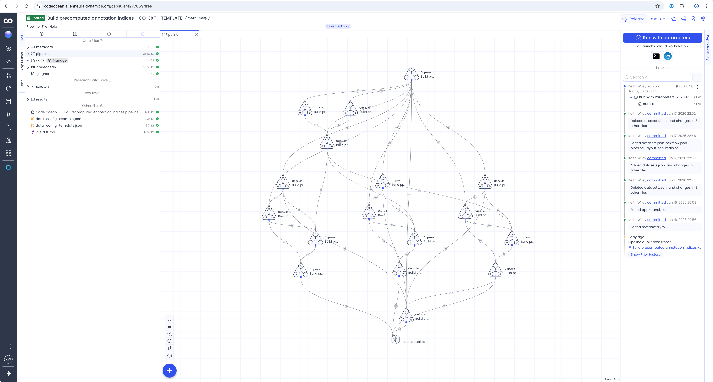
	

5. ***Please don't use this pipeline! I believe it is shared in a read-only status, but please pay attention anyway. Instead, immediately duplicate it, thusly:***
	1. In the upper-left corner, find the menu bar and the left-most ***Pipeline*** menu. Expand that menu and select ***Duplicate***. Wait for it to process...

		

		
		&nbsp;&nbsp;&nbsp;&nbsp;&nbsp;
		
		

	2. Please confirm that you are working in a new pipeline. The pipeline's name along the top of the display will show "Copy of" if you were succesful. Feel free to rename the pipeline if you wish. Simply click on the name to edit it.
	
		

		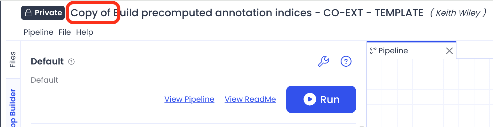
		

6. In the upper-left corner, along the left edge, vertically, notice ***Files***, ***App Builder***, and ***Tabs***. Select ***Files***. Next to the ***data*** section, notice, ***Manage*** with an associated gear icon.
	
	

	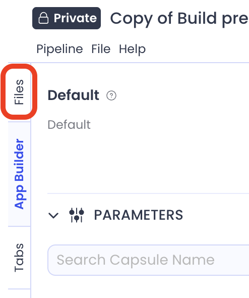
	&nbsp;&nbsp;&nbsp;&nbsp;&nbsp;
	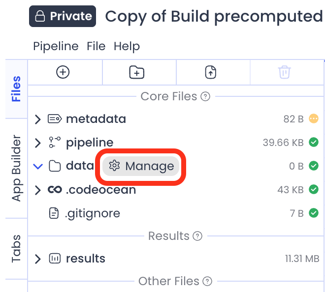
	

7. Click the Manage icon, which will open a chooser in the right half of the view.

	

	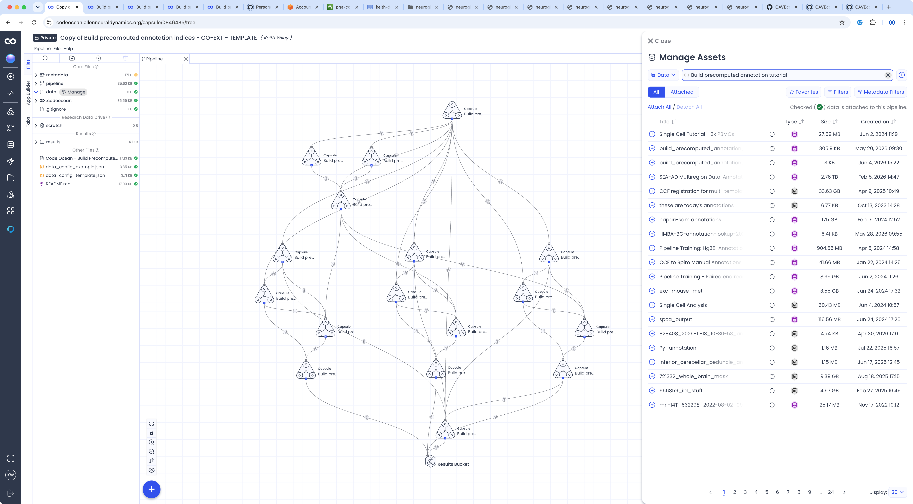
	

	
	1. Find your new data config json asset and add it to the pipeline.
	2. Find your new data asset and add it to the pipeline.

	

	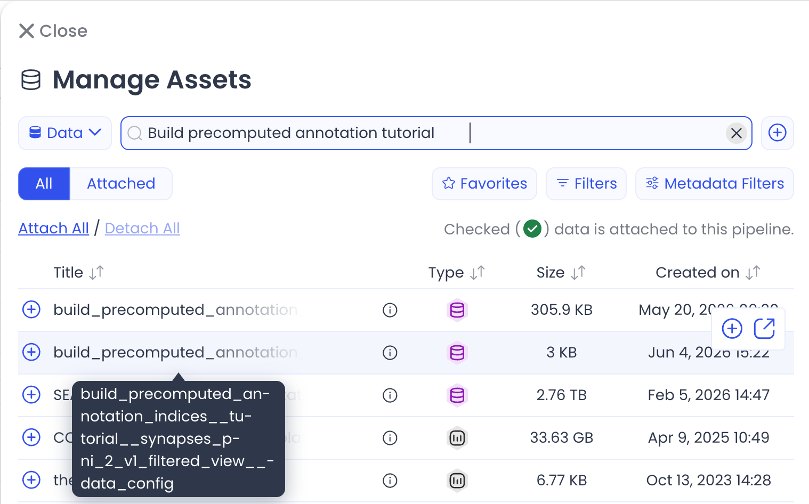
	&nbsp;&nbsp;&nbsp;&nbsp;&nbsp;
	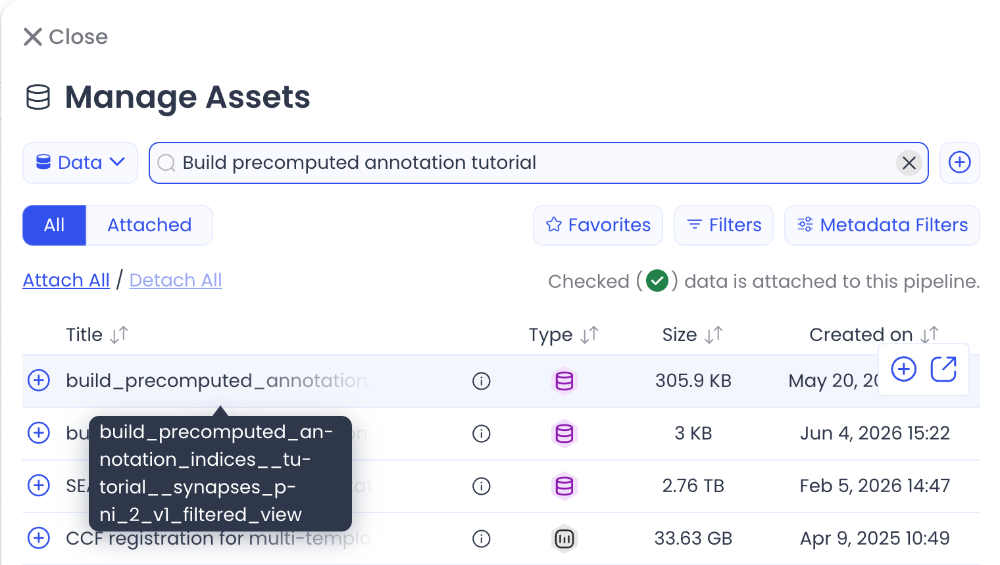
	

	
	

	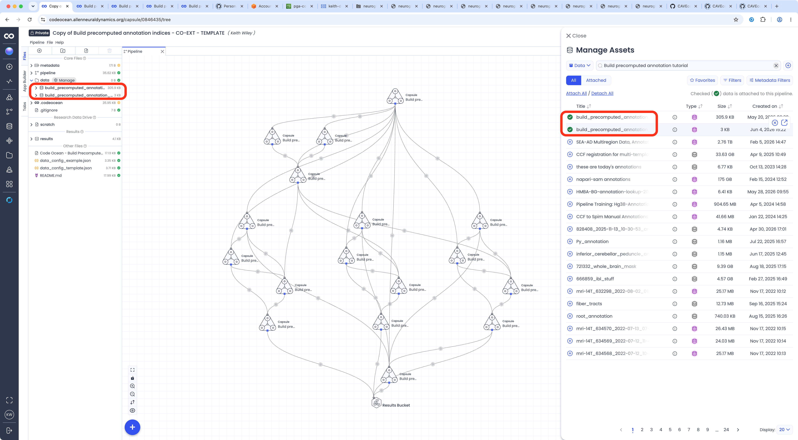
	

8. Drag both the data config asset and the data asset from the data section on the left half of the view to the *gridded canvas*. Place them in the upper-left region of the canvas so their connections will be easy to create. The config asset is the one placed farther to the right, near the top-most capsule of the flow diagram.

	

	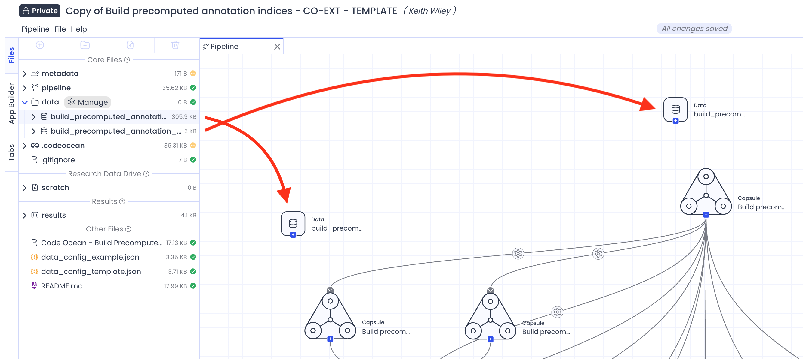
	

	
9. Connect the data config asset to the ***generate config*** capsule by click-dragging from the asset's ***PLUS*** icon to the capsule icon. Connect the data asset (via its ***PLUS*** icon) to the ***generate input split*** capsule.
		
	

	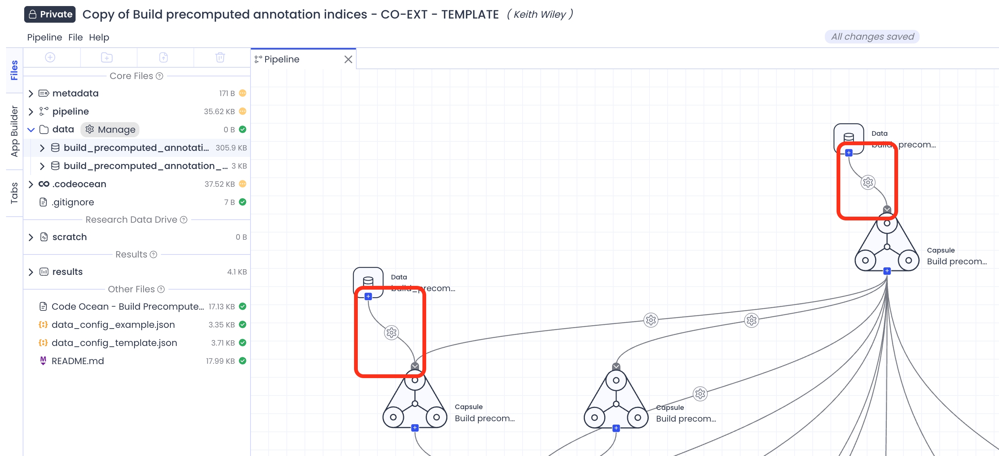
	

10. Edit the data connection:
	1. Click the gear icon of the connection to open its settings.

	

	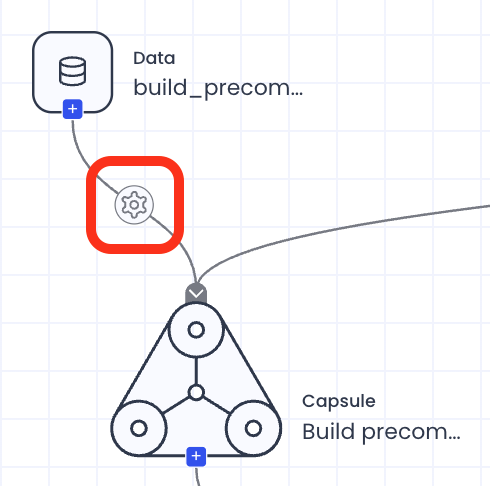
	

	
	2. Change the ***Connection Type*** from *Default* to *Collect*.
	3. Click Confirm.

	

	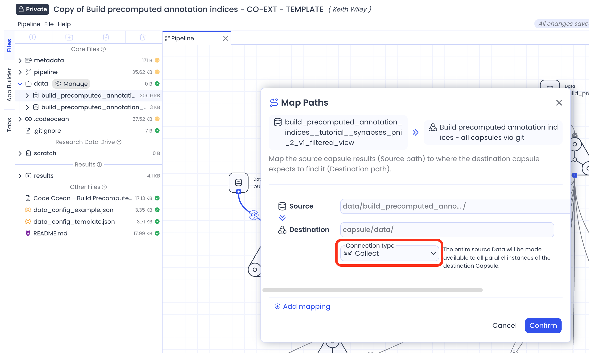
	

11. In the upper-left corner, select ***App Builder*** to reveal a new panel on the left side of the view. With the App Builder panel visible on the left side of the view, look at the right side now. If you don't see the ***Run with parameters*** button, click the ***Reproducibility*** button to open the right panel. Click the ***Show more history*** button at the bottom.

	

	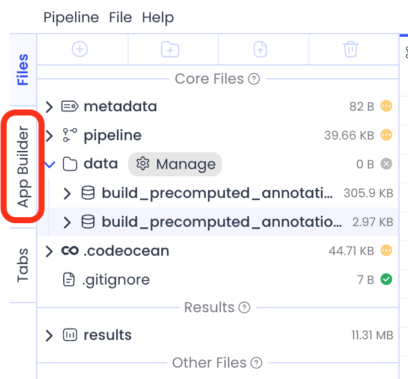
	

	

	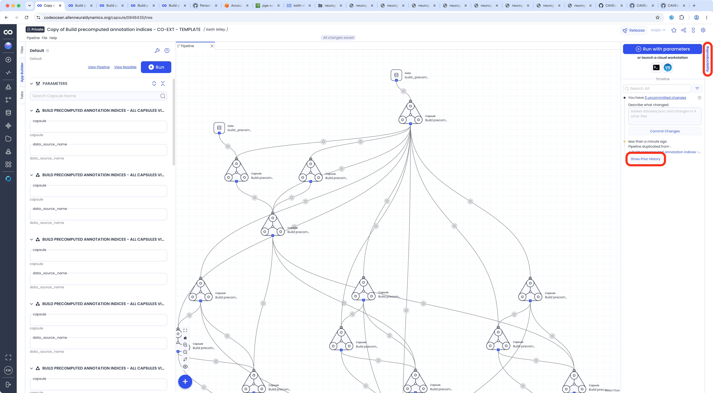
	

12. The first historical run will be labeled *"Run With Parameters 1762007"* with timestamp *"Jun 17, 2026 22:53"*.

	

	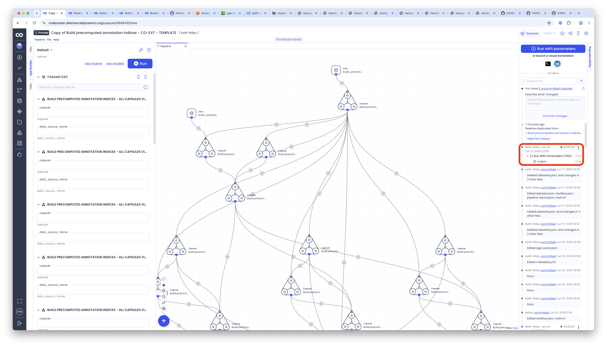
	

	
	Click the upper of the two three-dot menus (the one directly next to the duration *"00:00:58"*) to open the menu. Click the ***Parameter values*** option to open the parameters from that previous run. At the top of the parameters view, click the ***three-sliders*** button (it has a hover text that says *"Apply to App Panel"*).
	
	

	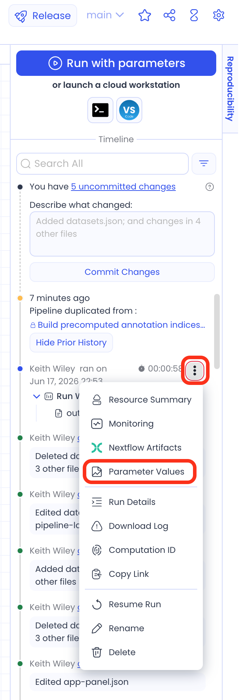
	&nbsp;&nbsp;&nbsp;&nbsp;&nbsp;
	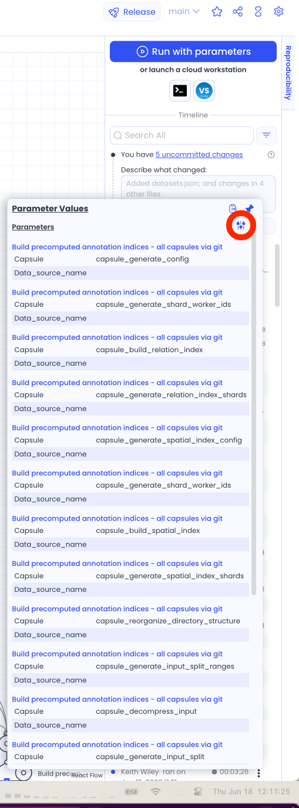
	

		
	This will immediately populate all the necessary hard-coded parameters in the App Builder on the left side of the overall view.
	
	

	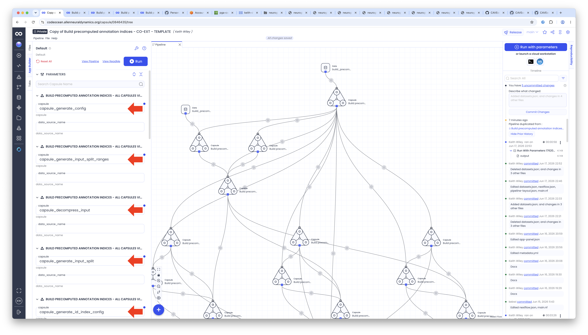
	

13. ***Optionally*** set the ***data\_source\_name*** parameter of the ***capsule\_generate\_config*** capsule (the first set of parameters in the App Builder) 

	

	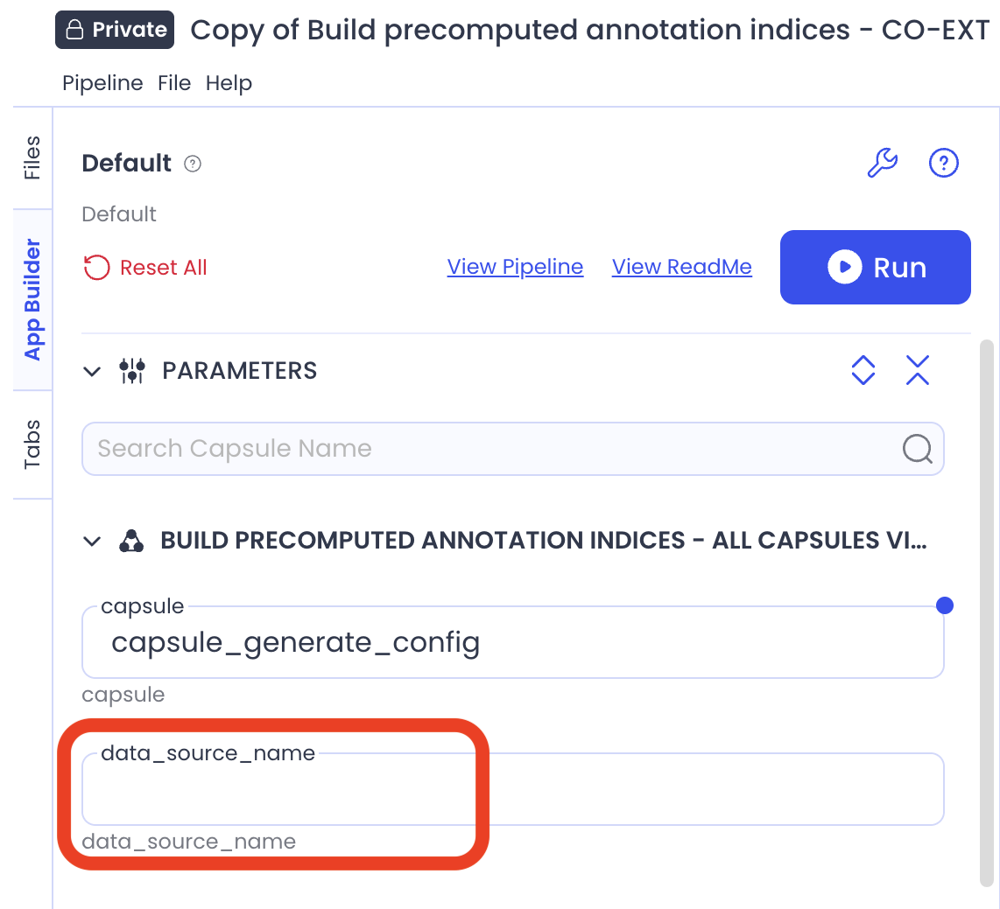
	

	This is the only parameter you might need to specialize to your data and your pipeline run. If needed, set this parameter to the data size label of your preference indicated in your data config json file (in the json's "data_sizes" section). You only have to assign this parameter if you have arranged your config file to indicate multiple data options and you don't want to use the largest option (presumably the full dataset). For example, you might offer smaller subsets of the main data intended for development or debugging, and those are the ones you must specify with this parameter if you wish to use them. For the tutorial, you don't have to do anything here since the tutorial config only indicates on dataset anyway. The default value of an empty string will use the largest (and only) dataset specified in the config file. Notice that in the config json file we added to the project, the "data\_sizes" section only contains a single entry.

	Here's a helpful way to find a string to populate this parameter without going back to the json file on your local computer:
	1. Switch from the App Builder view to the Files view.
	2. Click the data config asset under the data folder. This will expand its drop-down view to reveal its contents, namely your json file.
	3. Click the json file. This will open the file in a new tab in the main display shared by the canvas.
	4. Find the "data_sizes" section in the json file. Then find the label you assigned, and copy it. You can then return to the App Builder panel shown below and paste it into the ***data\_source\_name*** parameter.

	As stated above, if you don't wish to choose between multiple datasets, leaving the parameter field in the App Builder blank will work fine. Other values that mean "Use the largest dataset available in the config file" are ***na***, ***none***, and ***a single space character*** (since the App Builder interface will not permit a blank parameter value).
	
14. In the upper-right corner, notice the ***Run with parameters*** button. If you don't see it, toggle the ***Reproducibility*** option in the upper-right corner to reveal the button. Note that there is also a ***Run*** button in the App Builder section you just populated; I think both buttons do the same thing. Click one of these buttons to run the pipeline.

	

	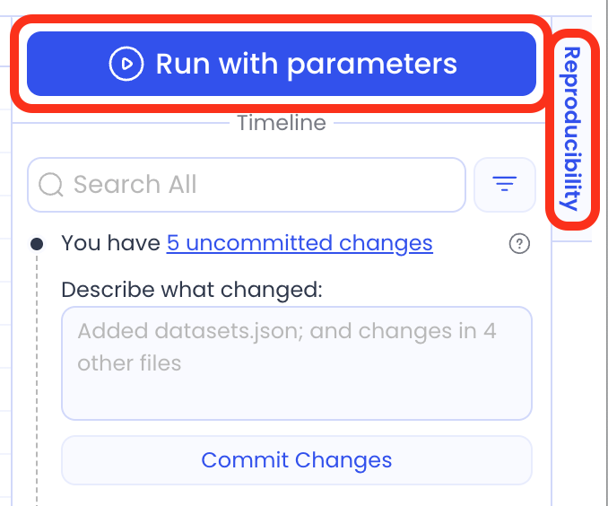
	

	
15. You can observe the pipeline running on the canvas. Capsules in-process will be animated slightly, and connections actively passing data between assets or capsules will also be animated (and blue).

	

	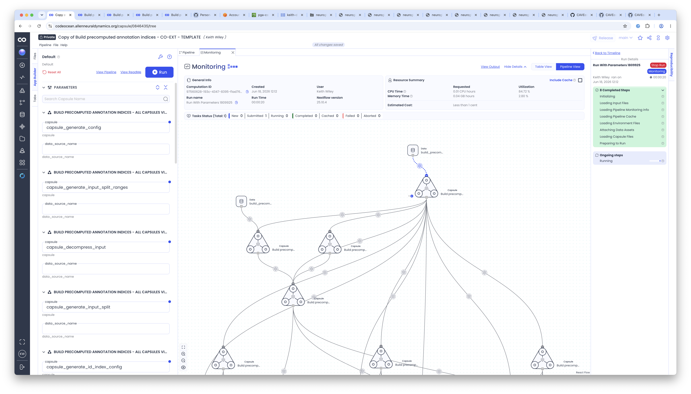
	

	

	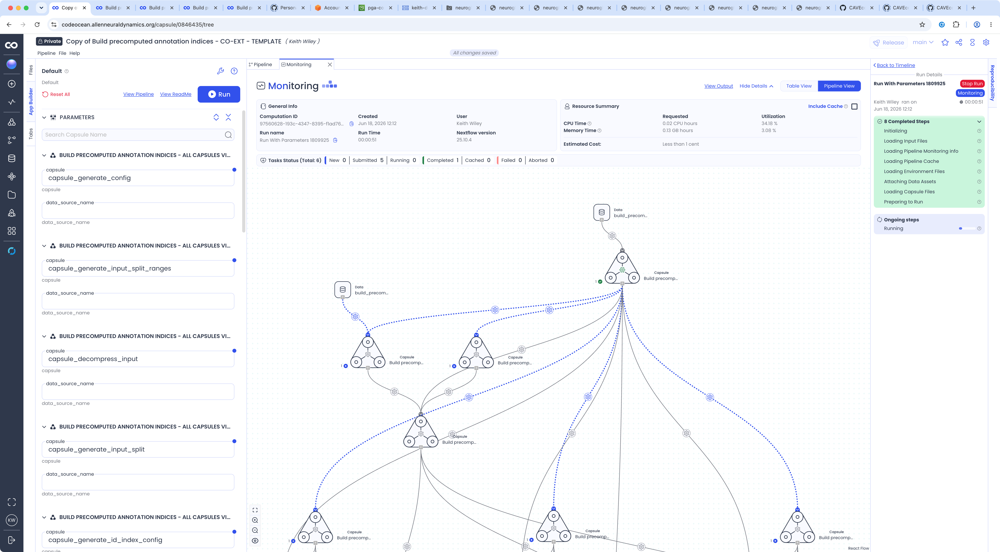
	

	
	It can take upwards of an hour for the pipeline to run on larger datasets. It should take 5–15 minutes for small datasets. Take note of any failures and notify Keith. If all capsules end up with green success indictors, and there are no other indications of failure, then the pipeline has completed successfully.
		
	

	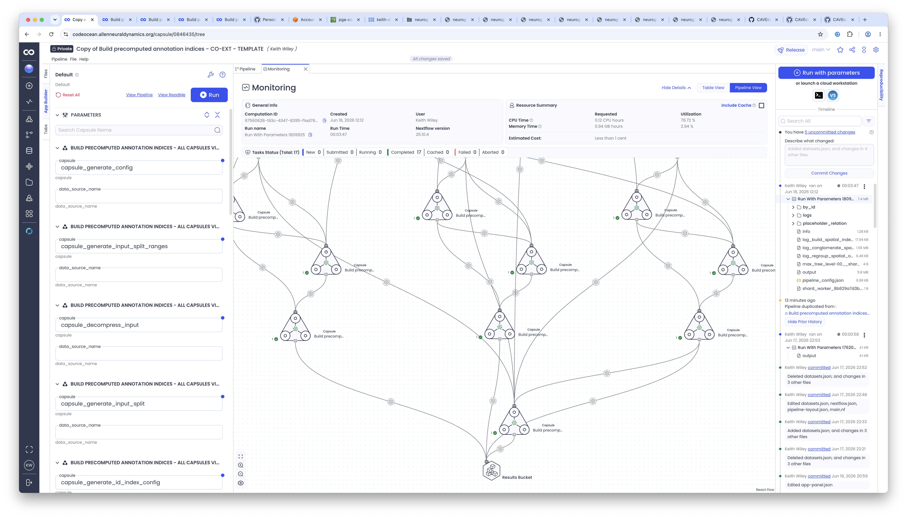
	

	
16. Completed runs appear along the right side of the display (toggle ***Reproducibility*** in the upper-right to see this, as needed). Familiarize yourself with the file & folder structure of the results. They closely mirror the structure that is uploaded to the Google bucket. Click the ***pipeline\_config.json*** file to see that file displayed in the main view. Some parts of this file will be similar to your input data config file from above, but other parts will be new. In the file, find the ***NEUROGLANCER\_URI*** entry. It will have the form of `gs://keith-dev/ng_precomputed_annotations_unreleased/<SOME_TIMESTAMP>/`.

	

	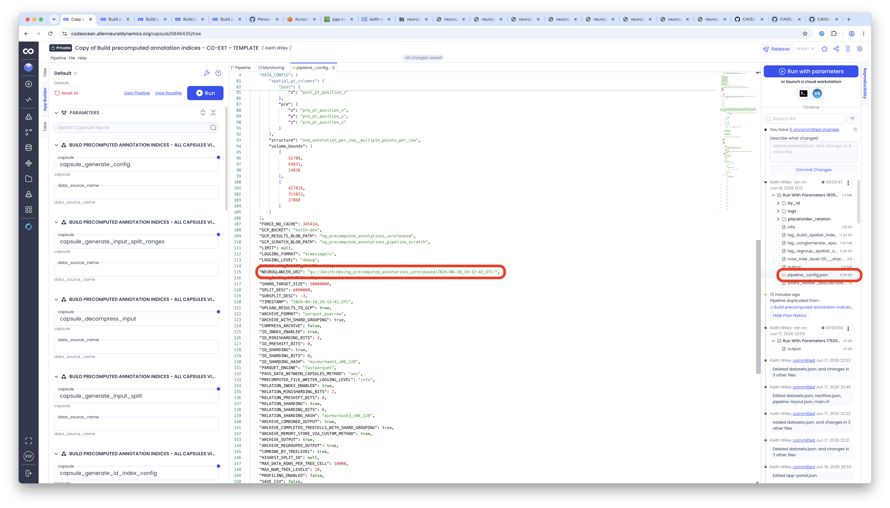
	

	
17. Copy this value. In a Neuroglancer view, add a new layer. In the upper-right corner, select ***Source***, and paste the URI you just copied. Neuroglancer will immediately begin using the new three-part index.

	

	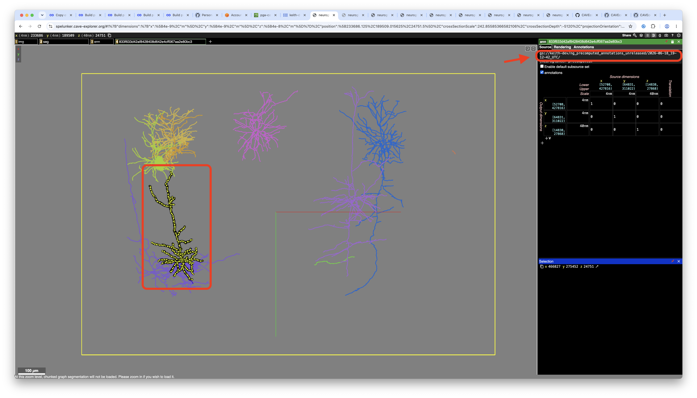
	

	
18. The admin (Keith) has the option to move unreleased indices to a more public-facing URI (one that doesn't have "unreleased" in the URI). Ask Keith for help with this as needed.

### Done!

Congratulations on what I'm confident was a flawless and satisfying experience.
